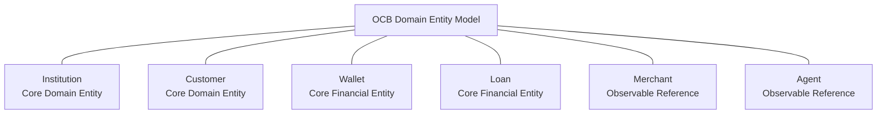

# OCB Domain Entity Model

## Purpose

This diagram represents the approved domain-level financial entity model for OCB Platform v1.0.0.

It identifies the entities retained through WP-1.2 and distinguishes core financial/domain entities from lightweight observable reference entities.

The model is conceptual. It does not define physical database structures, attributes, keys, cardinalities, or implementation mechanisms.

## Approved Entities

- Institution — Core Domain Entity
- Customer — Core Domain Entity
- Wallet — Core Financial Entity
- Loan — Core Financial Entity
- Merchant — Lightweight Observable Reference
- Agent — Lightweight Observable Reference

## Domain Entity Model

