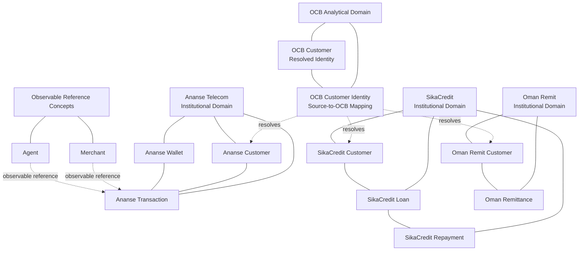

**Programme:** OCB Platform v1.0.0

**Work Package:** WP-1.2 — Financial Entity Model

**Ticket:** WP-1.2-T04

**Status:** **REVISED / RECONCILED**

**Decision Type:** Domain entity model and entity-boundary definition

---

# OCB Domain Entity Model

## Purpose

This document establishes the approved **domain-level entity model** for OCB Platform v1.0.0.

The model has been reconciled against:

* WP-1.2-T01 — Initial Financial Entity Inventory;
* WP-1.2-T02 — Financial Entity Responsibility Definitions;
* WP-1.3 — Financial Event Catalogue and Semantics;
* WP-1.4 — Financial State Model;
* WP-2.1 — Conceptual Data Model; and
* WP-2.2 — Logical Data Model.

The purpose of this model is to establish **what entities exist, who owns them, and how OCB relates to them conceptually**.

It does not define physical database structures, attributes, primary keys, foreign keys, normalization, indexes, or implementation mechanisms.

---

# 1. Reconciliation with the Earlier Entity Inventory

The original WP-1.2 entity inventory identified:

* Institution;
* Customer;
* Wallet;
* Loan;
* Merchant; and
* Agent.

Subsequent architectural work has refined those concepts.

The current model distinguishes between:

```text
OCB Analytical Identity
        ↓
Source-Owned Institutional Entities
        ↓
Observable Reference Concepts / Roles
```

The current logical model confirms that the authoritative relational entity set is:

```text
OCB
├── OCB_CUSTOMER
└── OCB_CUSTOMER_IDENTITY

ANANSE TELECOM
├── ANANSE_CUSTOMER
├── ANANSE_WALLET
└── ANANSE_TRANSACTION

SIKACREDIT
├── SIKACREDIT_CUSTOMER
├── SIKACREDIT_LOAN
└── SIKACREDIT_REPAYMENT

OMAN REMIT
├── OMAN_REMIT_CUSTOMER
└── OMAN_REMIT_REMITTANCE
```

This is the current authoritative entity baseline established by WP-2.2.

---

# 2. Approved Domain Concepts

The approved domain model therefore contains the following conceptual categories.

| Concept                | Classification                         | v1.0.0 Treatment                                                    |
| ---------------------- | -------------------------------------- | ------------------------------------------------------------------- |
| Institution            | Institutional boundary                 | Retained conceptually; not a required first-class relational entity |
| OCB Customer           | OCB analytical identity                | Core OCB entity                                                     |
| OCB Customer Identity  | Identity-resolution relationship       | Core OCB entity                                                     |
| Institutional Customer | Source-owned domain entity             | Core institutional entity                                           |
| Wallet                 | Source-owned financial entity          | Core Ananse entity                                                  |
| Transaction            | Source-owned financial activity entity | Core Ananse entity                                                  |
| Loan                   | Source-owned financial entity          | Core SikaCredit entity                                              |
| Repayment              | Source-owned financial activity entity | Core SikaCredit entity                                              |
| Remittance             | Source-owned financial activity entity | Core Oman Remit entity                                              |
| Merchant               | Observable reference concept           | Not a first-class relational entity in v1.0.0                       |
| Agent                  | Observable reference concept           | Not a first-class relational entity in v1.0.0                       |
| Sender                 | Remittance role                        | Not an independent entity                                           |
| Beneficiary            | Remittance role                        | Not an independent entity                                           |
| Borrower               | Customer role                          | Not an independent entity                                           |

---

# 3. Domain Entity Model

The approved conceptual model is:



The solid relationships represent conceptual ownership or source-domain relationships.

The dotted relationships represent observational or analytical relationships rather than ownership transfers.

The logical model subsequently implements the appropriate relationships through the structures defined in WP-2.2. Its authoritative relational entity set is explicitly limited to the ten entities identified above.

---

# 4. OCB Analytical Domain

OCB contains two distinct identity concepts.

## 4.1 OCB Customer

OCB Customer represents the **resolved cross-institutional identity** used for supervisory and analytical correlation.

It does not replace institutional customer entities.

```text
ANANSE CUSTOMER
       \
        \
SIKACREDIT CUSTOMER → OCB CUSTOMER
        /
       /
OMAN REMIT CUSTOMER
```

Identity resolution is represented separately through OCB Customer Identity.

## 4.2 OCB Customer Identity

OCB Customer Identity represents the relationship between:

```text
Source Entity
+
Source Customer ID
        ↓
OCB Customer ID
```

This prevents OCB from inserting an OCB-owned identity directly into source institutional records.

The logical model therefore deliberately avoids adding `ocb_customer_id` to the institutional customer entities.

---

# 5. Ananse Telecom Domain

The Ananse domain contains three core source-owned entities:

```text
ANANSE TELECOM

Customer
   │
   ├───────────────┐
   ↓               ↓
Wallet        Transaction
```

## 5.1 Ananse Customer

Represents the customer record maintained by Ananse Telecom.

Customer attributes remain source-owned.

## 5.2 Ananse Wallet

Represents the Ananse mobile-money wallet as a distinct financial object.

The wallet is not merged with Customer or Transaction.

WP-1.4 confirms that Customer Wallet Balance is a financial position associated with the wallet, while the wallet itself remains a distinct institutional object.

## 5.3 Ananse Transaction

Represents individual Ananse financial activity.

The approved financial events represented within the Ananse transaction domain are:

```text
Cash-in
Cash-out
P2P Transfer
Merchant Payment
```

P2P Send and P2P Receive remain financial legs of the P2P Transfer rather than independent entities or events.

---

# 6. SikaCredit Domain

The SikaCredit domain contains:

```text
SIKACREDIT

Customer
   │
   ↓
Loan
   │
   ↓
Repayment
```

## 6.1 SikaCredit Customer

Represents the customer record maintained by SikaCredit.

It remains independent of the Ananse and Oman Remit customer entities.

## 6.2 SikaCredit Loan

Represents the lending obligation maintained by SikaCredit.

The borrower is a **Customer role** rather than a separate entity.

## 6.3 SikaCredit Repayment

Represents an individual repayment activity associated with a SikaCredit loan.

The logical model deliberately separates repayments from the loan rather than storing multiple repayments inside the loan entity.

---

# 7. Oman Remit Domain

The Oman Remit domain contains:

```text
OMAN REMIT

Customer
   │
   ↓
Remittance
```

## 7.1 Oman Remit Customer

Represents the customer record maintained by Oman Remit.

## 7.2 Oman Remittance

Represents the authoritative remittance activity recognised within the OCB observation boundary.

Sender and beneficiary are **roles within the remittance activity**, not independent OCB entities.

The beneficiary financial position remains a conceptual financial position within the Oman Remit domain and is not introduced as a separate relational entity in WP-2.2.

---

# 8. Merchant and Agent

Merchant and Agent remain valid **observable source-domain concepts**, but they are not approved as first-class relational entities in the current v1.0.0 logical model.

## 8.1 Merchant

Merchant is relevant to the semantics of Ananse Merchant Payment.

OCB may observe merchant information where required by an approved analytical or intelligence requirement.

However, v1.0.0 does not establish a persistent Merchant entity.

OCB therefore does not model:

* merchant accounts;
* merchant settlement;
* merchant float;
* acquiring architecture; or
* merchant operational management.

## 8.2 Agent

Agent is relevant to agent-mediated Ananse activity, particularly Cash-in and Cash-out.

OCB may observe agent information where required by an approved analytical or intelligence requirement.

However, v1.0.0 does not establish a persistent Agent entity.

OCB therefore does not model:

* agent float;
* agent liquidity;
* commissions;
* settlement;
* agent network management; or
* other internal agent operations.

This prevents the domain model from promising entities that the current logical model does not actually implement.

---

# 9. Institution as a Domain Boundary

Institution remains important to the conceptual model.

However, the role of Institution is to establish **ownership and domain context**, not to force all institutional domains into a generic institutional entity hierarchy.

The current model is therefore:

```text
INSTITUTIONAL DOMAIN
        │
        ├── Ananse Telecom
        ├── SikaCredit
        └── Oman Remit
```

rather than:

```text
INSTITUTION
    │
    ├── generic customer
    ├── generic account
    ├── generic transaction
    └── generic financial object
```

The latter would incorrectly collapse independent institutional architectures.

WP-2.2 explicitly preserves institutional separation.

---

# 10. Entity Ownership Boundary

The approved ownership principle is:

```text
SOURCE INSTITUTION
        ↓
SOURCE-OWNED ENTITY / ACTIVITY
        ↓
AUTHORITATIVE FINANCIAL CONSEQUENCE
        ↓
INSTITUTIONAL FINANCIAL STATE
        ↓
OCB OBSERVATION
        ↓
IDENTITY RESOLUTION
        ↓
OCB ANALYTICAL MODEL
```

OCB does not become the operational owner of:

* Ananse wallets;
* SikaCredit loans;
* Oman Remit remittances; or
* institutional customer records.

WP-1.3 and WP-1.4 explicitly establish this boundary.

---

# 11. Relationships Not Established at This Level

The domain model does not establish direct institutional relationships merely because financial activity may eventually produce a cross-domain consequence.

In particular, it does not imply:

```text
SikaCredit → Ananse Wallet
```

or:

```text
Oman Remit → Ananse Wallet
```

as source-entity ownership relationships.

WP-2.2 deliberately avoids such cross-institutional foreign keys.

Cross-domain financial consequences belong to the financial-core and ledger architecture.

---

# 12. Relationship to the Logical Model

The domain model is conceptual.

The current logical model provides the implementation-oriented representation of its approved entities:

```text
OCB
├── OCB_CUSTOMER
└── OCB_CUSTOMER_IDENTITY

ANANSE
├── ANANSE_CUSTOMER
├── ANANSE_WALLET
└── ANANSE_TRANSACTION

SIKACREDIT
├── SIKACREDIT_CUSTOMER
├── SIKACREDIT_LOAN
└── SIKACREDIT_REPAYMENT

OMAN REMIT
├── OMAN_REMIT_CUSTOMER
└── OMAN_REMIT_REMITTANCE
```

This entity set is confirmed as the authoritative relational baseline in WP-2.2.

The domain model therefore must not introduce additional first-class entities that are absent from the locked logical model without reopening the relevant architectural decision.

---

# 13. Final Domain Entity Decision

The revised v1.0.0 domain entity model is:

| Domain         | Approved Core Entities              | Observable / Role Concepts      |
| -------------- | ----------------------------------- | ------------------------------- |
| OCB            | OCB Customer; OCB Customer Identity | —                               |
| Ananse Telecom | Customer; Wallet; Transaction       | Merchant; Agent                 |
| SikaCredit     | Customer; Loan; Repayment           | Borrower as Customer role       |
| Oman Remit     | Customer; Remittance                | Sender and Beneficiary as roles |
| Institution    | Institutional domain boundary       | —                               |

The following are **not first-class v1.0.0 entities**:

* generic Institution relational entity;
* generic Customer entity;
* Merchant;
* Agent;
* Sender;
* Beneficiary;
* Borrower;
* Financial Account;
* P2P Send;
* P2P Receive;
* Loan Default;
* Loan Closure;
* Settlement;
* Correction;
* Reversal;
* Adjustment.

---

# 14. Status

**Status: REVISED / RECONCILED**

WP-1.2-T04 has been revised to reflect the entity boundaries established by the completed WP-1.3 financial-event work, the WP-1.4 state model, and the current WP-2.1 conceptual and WP-2.2 logical models.

The previous six-entity model is superseded.

The approved domain model now distinguishes:

1. OCB-resolved identity;
2. source-owned institutional entities;
3. institutional domain boundaries;
4. observable reference concepts; and
5. participant roles.

The current model is consistent with the authoritative ten-entity relational baseline established in WP-2.2.

---

## Core Principle

> **The domain model represents the entities that own or participate in financial reality; OCB resolves identities across those domains without collapsing institutional ownership or creating entities merely because they are analytically useful.**
